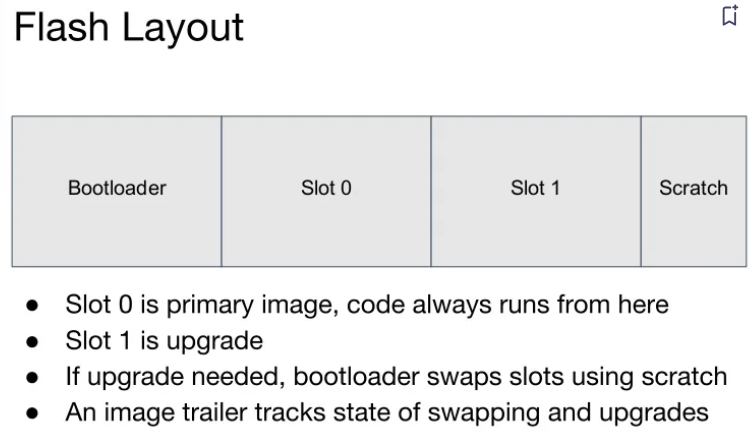
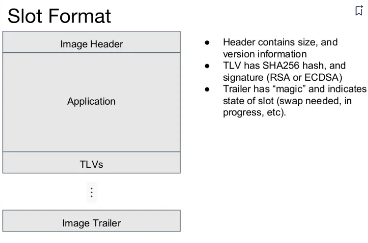
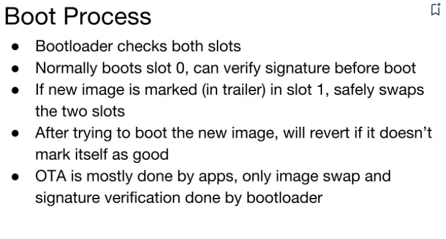

# **MCUBoot**

## **一、地址：**

[https://github.com/mcu-tools/mcuboot^^](https://github.com/mcu-tools/mcuboot)

## **二、目前已经采用mcuboot的rtos**

* [Zephyr](https://www.zephyrproject.org/)
* [Apache Mynewt](https://mynewt.apache.org/)
* [Apache NuttX](https://nuttx.apache.org/)
* [RIOT](https://www.riot-os.org/)
* [Mbed OS](https://os.mbed.com/)
* [Espressif](https://www.espressif.com/)
* [Cypress/Infineon](https://www.cypress.com/)

## **三、MCUBoot介绍**





## **四、MCUBoot支持的不同擦除方式**

| 升级方式                   | 优点                                                                                                            | 缺点                                                                                      |
| -------------------------- | --------------------------------------------------------------------------------------------------------------- | ----------------------------------------------------------------------------------------- |
| MCUBOOT_OVERWRITE_ONLY     | 不会使用额外的flash区域，算法简单，维护简单                                                                     | 不能保护源版本，升级失败后设备可能变砖                                                    |
| MCUBOOT_SWAP_USING_SCRATCH | 可以保护源版本，升级失败后可以恢复到原来的版本，容错率高                                                        | flash的使用量增加，scratch区域flash擦写次数成倍增加，损坏风险大大增加，算法复杂，维护困难 |
| MCUBOOT_SWAP_USING_MOVE    | 可以保护源版本，升级失败后可以恢复到原来的版本，容错率高，相对MCUBOOT_SWAP_USING_SCRATCH方式，flash擦写更加均匀 | 此算法仅限于拥有相同布局的flash， 所有插槽的扇区应具有相同的大小                          |

## **五、MCUBoot移植**

### 5.1、MCUBoot资源占用

MCUBoot基础代码 + Swap Move + 回滚 + 签名验证

```
==============================================================================

    Total RO  Size (Code + RO Data)                35912 (  35.07kB)
    Total RW  Size (RW Data + ZI Data)              8272 (   8.08kB)
    Total ROM Size (Code + RO Data + RW Data)      35956 (  35.11kB)

==============================================================================
```

## 六、mcuboot固件生成

[mcu固件生成](mcu固件生成.md)
