# **一、工具准备**

## **imgtool**

该 Python 程序脚本位于mcuboot/scripts/imgtool.py。可以用于执行管理密钥和image签名所必需的操作。

此程序依赖于几个 Python 库，可以通过 'pip3' 安装：

pip3 install --user -r scripts/requirements.txt

提示缺少yaml可以再安装pyyaml，具体步骤参考附录2

# **二、前情提要**

## **Flash Layout (Swap Move**

还有另外一种交换算法，但对Scratch区Flash磨损较大，当各Sector大小相同时，可选择Swap Move，使各Sector磨损相同

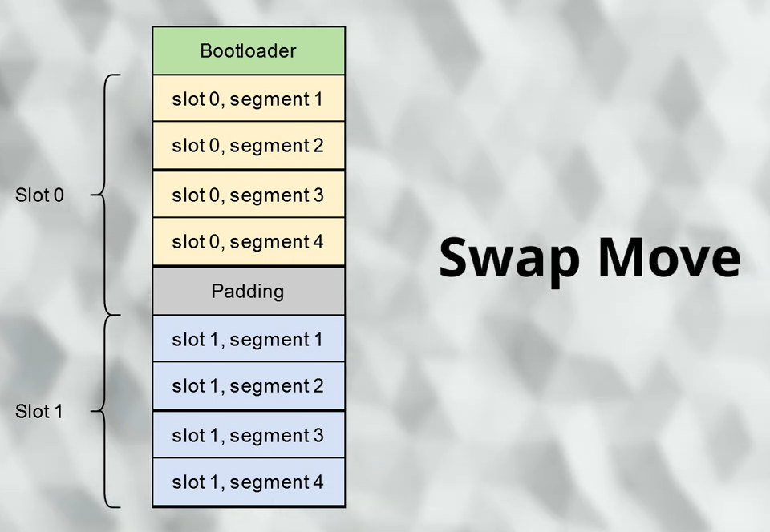

## **固件 Layout**

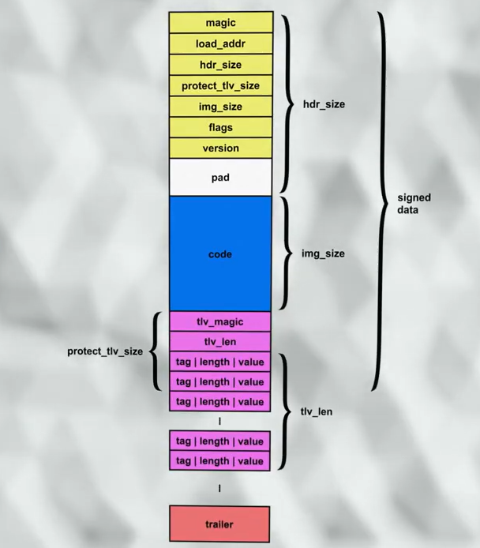

固件的启动地址为code的首地址，Header结构体的大小程序中有定义为32字节

`#define IMAGE_HEADER_SIZE           32`

但imgtool会设定Header实际占用大小，通常设置一个最小擦除单位大小，比如0x1000

所以Payload的实际地址为slot0的首地址-0x1000

具体程序中，Flash Layout如下

```C
    {FAL_PART_MAGIC_WORD, "boot"      , FAL_USING_ONCHIP_FLASH_DEV_NAME, 0         , 64  * 1024, 0}, \
    {FAL_PART_MAGIC_WORD, "params"    , FAL_USING_ONCHIP_FLASH_DEV_NAME, 64  * 1024, 64  * 1024, 0}, \
    {FAL_PART_MAGIC_WORD, "primary"   , FAL_USING_ONCHIP_FLASH_DEV_NAME, 128 * 1024, 512 * 1024, 0}, \
    {FAL_PART_MAGIC_WORD, "secondary" , FAL_USING_ONCHIP_FLASH_DEV_NAME, 640 * 1024, 384 * 1024, 0}, \
```

primary对应slot0，首地址为0x08020000，app启动地址为0x08021000。大小为512K比secondary多一个sector。

secondary对应slot1，首地址为0x080A0000。大小为384K。

# **三、准备密钥**

代码仓库中已准备的测试用的密钥，因为已经公开，所以在实际生产环境中，应该重新生成私钥并妥善保存。同用新生成的密钥获取公钥并合并到bootloader代码中。

## **1、生成**私钥

```C
python imgtool.py keygen -k filename.pem -t ed25519 
```

## **2、获取****公钥****并集成到代码中**

此命令将从给定的私钥文件中提取公钥，并将其输出为 C 数据结构。

```C
 python imgtool.py getpub -k filename.pem
```

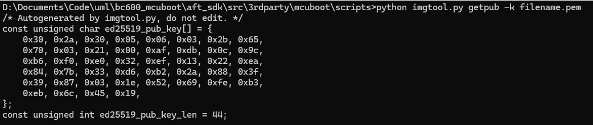

将结果生成到C文件中

```C
python imgtool.py getpub -k filename.pem > ed25519_pub_key.c
```

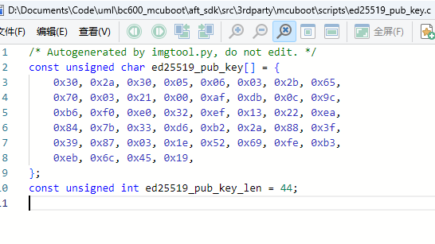

## **3、替换boot工程中**公钥

将生成的新公钥替换到工程中，并重新生成boot固件，生产过程中此密钥不可再更换，请妥善保存。

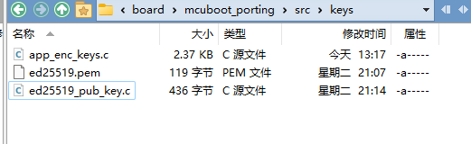

# **四、准备app固件**

## **1、设定app固件偏移地址**

**注意为header预留0x1000空间**

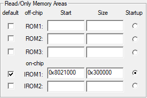

代码中在main入口处增加

```C
nvic_vector_table_set(NVIC_VECTTAB_FLASH, 0x20000+0x1000);//slot start address + header_size
```

## **2、编译生成固件****bin****文件**

## **3、使用imgtool签名固件**

### **1）app固件签名**

在app固件在slot0中，boot会直接启动改区域程序

`sign_app.sh`

```Bash
#! /bin/bash
# imgtool.py 位置
IMGTOOL_PY="D:\Documents\Code\uml\bc600_mcuboot\aft_sdk\src\3rdparty\mcuboot\scripts\imgtool.py"
# 输入文件
INPUT_FILE="d:\Downloads\GD32F4xx_Firmware_Library_V3.2.0\GD32F4xx_Firmware_Library_V3.2.0\Template\Keil_project\Project.bin"
# 输出文件
OUTPUT_FILE="D:\Downloads\GD32F4xx_Firmware_Library_V3.2.0\GD32F4xx_Firmware_Library_V3.2.0\Template\Keil_project\signed_app_Project.bin"
# key
KEY_FILE="D:\Documents\Code\uml\bc600_mcuboot\target\gd32f470zkt6\board\mcuboot_porting\src\keys\ed25519.pem"
# 执行签名命令
python $IMGTOOL_PYsign \
  --key $KEY_FILE\
  --public-key-format hash\
  --version 1.0.0 \
  --header-size 0x1000 \
  --align 4 \
  --slot-size 0x60000 \
  --pad-header \
$INPUT_FILE$OUTPUT_FILE
echo"签名成功：$OUTPUT_FILE"
```

烧录签名后的程序

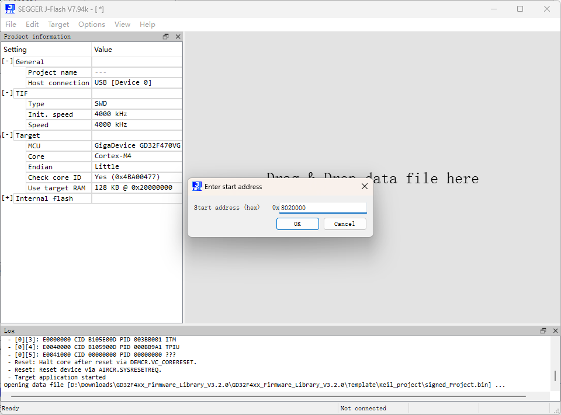

### **2）生成升级固件**

### **升级固件分两类：单次运行和永久运行。**

单次运行固件，重启后会回滚回原固件，可用于临时测试。

更常用的场景是，在单次运行固件代码中增加

```C
boot_set_pending(1);
```

表示当测试固件正常启动并自检成功后，标记为永久运行，这样就不会回滚固件了。

当然您也可以选择直接生成永久运行固件，在这种情况下MCUBoot永远不会在下次重启时尝试回滚固件。

强烈建议选择生成测试固件，以防止设备“变砖”。

> The optional --pad argument will place a trailer on the image that indicates that the image should be considered an upgrade. Writing this image in the secondary slot will then cause the bootloader to upgrade to it.

#### ***a、生成单次运行固件***

```Bash
#! /bin/bash
# imgtool.py 位置
IMGTOOL_PY="D:\Documents\Code\uml\bc600_mcuboot\aft_sdk\src\3rdparty\mcuboot\scripts\imgtool.py"
# 输入文件
INPUT_FILE="d:\Downloads\GD32F4xx_Firmware_Library_V3.2.0\GD32F4xx_Firmware_Library_V3.2.0\Template\Keil_project\Project.bin"
# 输出文件
OUTPUT_FILE="D:\Downloads\GD32F4xx_Firmware_Library_V3.2.0\GD32F4xx_Firmware_Library_V3.2.0\Template\Keil_project\upgrade_signed_Project.bin"
# key
KEY_FILE="D:\Documents\Code\uml\bc600_mcuboot\target\gd32f470zkt6\board\mcuboot_porting\src\keys\ed25519.pem"
# 执行签名命令
python $IMGTOOL_PYsign \
  --key $KEY_FILE\
  --public-key-format hash\
  --version 1.0.0 \
  --header-size 0x1000 \
  --pad-header \
  --slot-size 0x60000 \
  --pad \
  --align 4 \
$INPUT_FILE$OUTPUT_FILE
echo"签名成功：$OUTPUT_FILE"
```

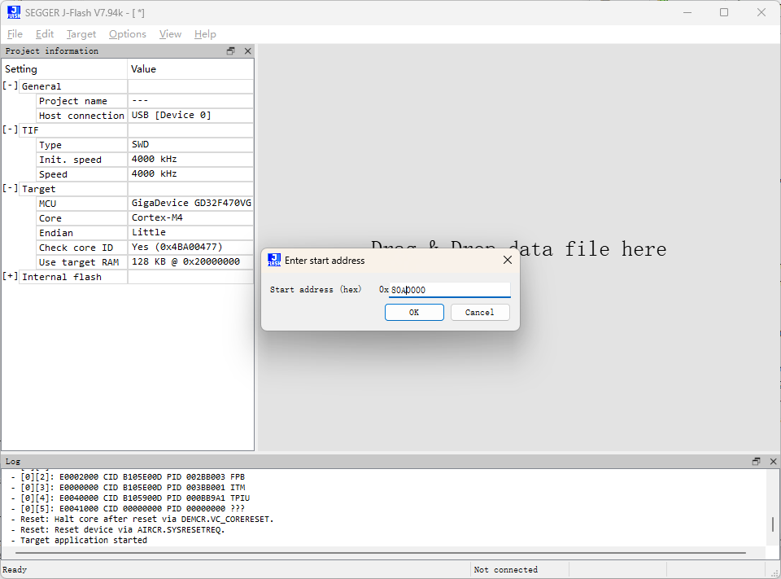

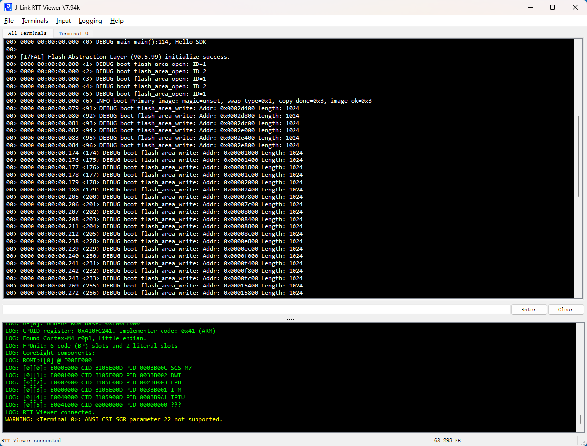

#### ***b、生成永久固件***

imgtool命令增加  `--confirm    #When padding the image, mark it as confirmed`

# **五、视频演示**

## 1、单次运行固件

固件LED1闪烁，重启后回滚到LED2闪烁


## 2、永久运行固件


## 4、仿造回滚效果

通过程序模拟每次运行都设置为单次运行，仿造回滚，所以每次重启都会回滚到上一个固件。

视频效果是：LED2固件->LED1固件->LED2固件


# **附录1 密钥类型**

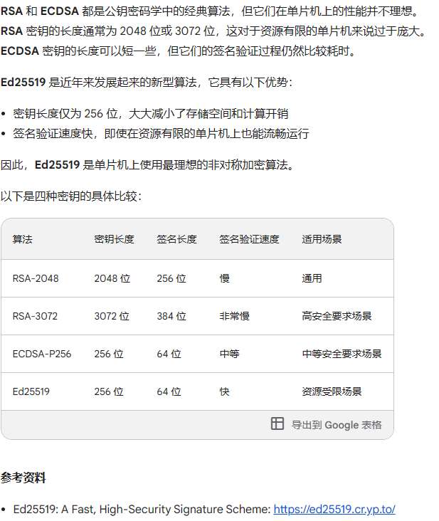

RSA和ED25519都是常用的加密算法之一，但是ED25519相比RSA有以下几点优势：

更高的安全性：ED25519比RSA更安全，因为它使用更长的密钥（256位）和更好的密码学属性。RSA加密算法的安全性基于大质数的难以分解性质，但是随着计算机的发展，RSA的安全性可能会受到威胁。而ED25519则使用的是椭圆曲线密码学，具有更好的安全性。

更快的密钥生成速度：ED25519密钥的生成速度比RSA更快，这意味着你可以更快地创建和使用SSH密钥。

更少的存储空间：ED25519密钥比RSA更短，占用更少的存储空间。

因此，如果您需要一个更加安全、快速和高效的SSH密钥，ED25519是一个更好的选择。同时，虽然RSA加密算法仍然广泛使用，但越来越多的人开始转向ED25519，因为它提供了更好的安全性和性能。

原文链接：https://blog.csdn.net/hadues/article/details/130675430

# **附录2 imgtool 安装**

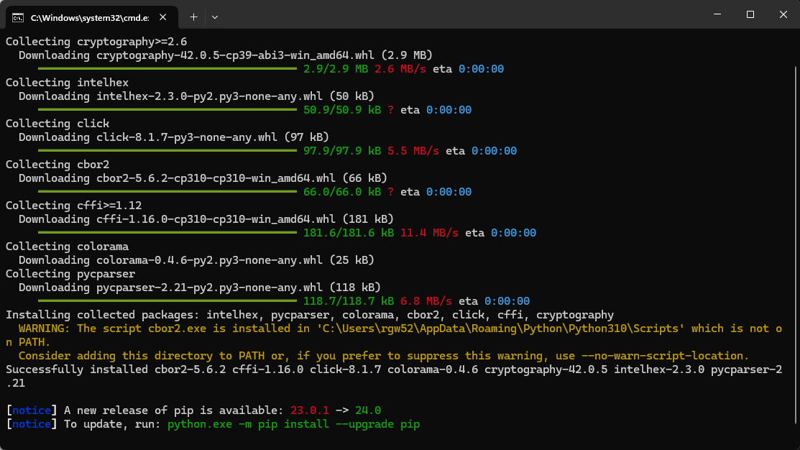

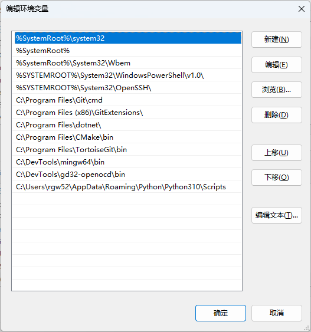

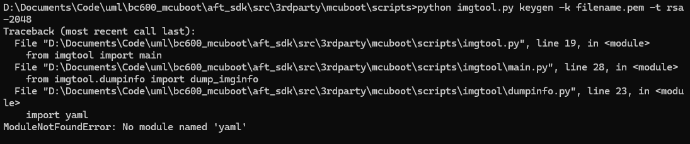

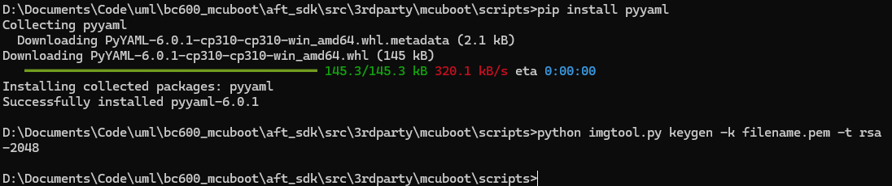

# 目前缺点：

生成升级固件大小为slot大小

boot整体固件较大，30+KB
